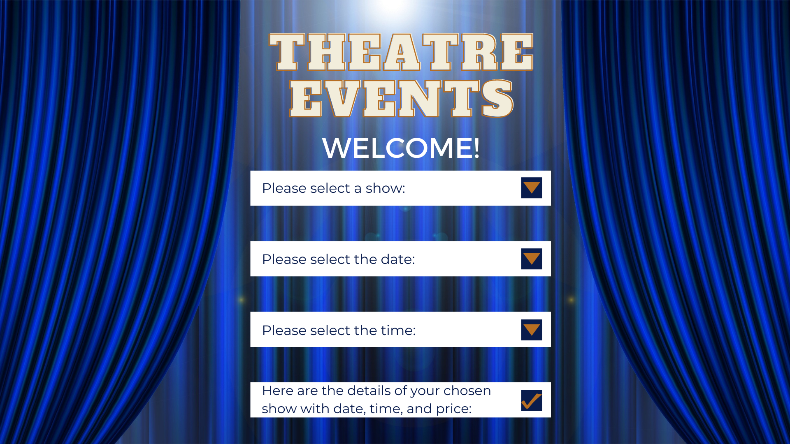

# Theatre Events MS
***

A Theatre Events microservice (MS) based on the Command Line APP that was created previously. I chose to keep the same theme as before because I would like to see my Theatre Event project be in two different technological settings

**The Inspiration:**

The inspiration for this app came to me in the shower after I had seen The Game Plan that starred Dwayne "The Rock" Johnson. In one scene, he danced a beautiful ballet with Roselyn Sanchez, which made me realise how much I miss the theatre, and I thought something theatre related would be suitable for this Microservice, as it was for the Command Line Application.

## Statement of Purpose

---
**What this microservice will do:**

The aim of this microservice is to create a front-end Theatre Events webpage that enables user interaction, so that a user can search for, and choose a theatre show, easily and simply.

Details of the show will be stored in the backend database...

**What business problem it addresses:**

The web page addresses the problem where a user may scroll through a long list of show titles until they find the one they want. With this webpage, users can simply use the drop-down menu to select the show they want, the date and time they wish to see it, and it will output the complete show details with show, date, time, and price.

**The target audience**

The target audience of this app are fans and lovers of art and culture, who want a simple and easy way to search for a show that will be part of their next cultured trip.

## The Visualisation

---

To assist myself with a visual aim of how the front-end will look for the user, I created a design in [Canva](https://www.canva.com/), which helped the creative process of this SpringBoot application.

I had a visualisation of the theatre curtains, and a welcome message displayed on the top with the app name. Underneath, there is a drop-down menu to select the options, and finalises the show details the end.

I also would like an option for the user if they do not find the show they want, so they can look at a list of shows available. The feature for this could not fit onto my PNG, unfortunately.

## Features

---
The features of the Microservice is so that users can select their show by four seperate drop-down menus:
1. Show name
2. Show date
3. Show time
4. Finalised details with the price 

## The Plan

---
1. Create the Model and add @Entity to store objects to the database:
   - Store list of shows with dates, times, and price
   - Store the user inputs
2. Create a Controller
   - Make a simple endpoint for starters
3. Create Thymeleaf template to allow endpoint to display with '/h2-console'
4. Think about what should be stored in the database
   1. List of shows with time, date, and price
   2. Should it be drop-down?
   3. Should users click on a link of a show to see details?
5. Make a web page design in Canva
