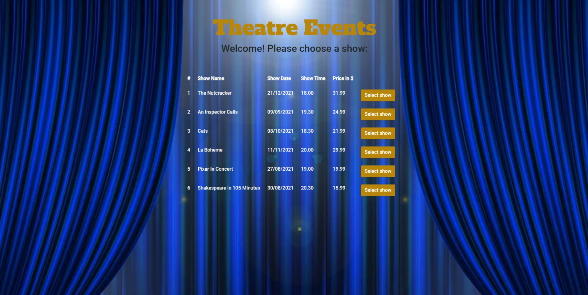
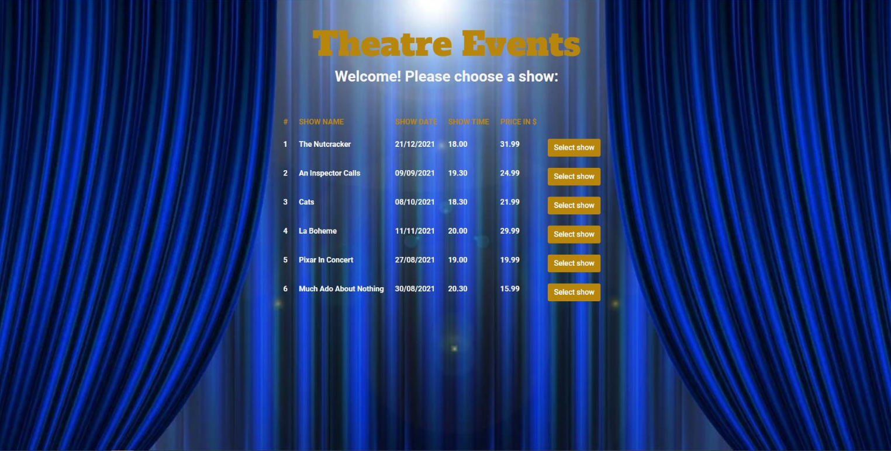
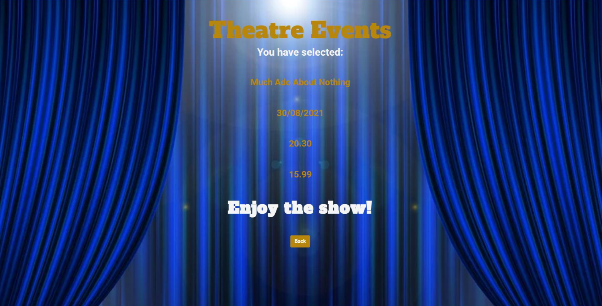
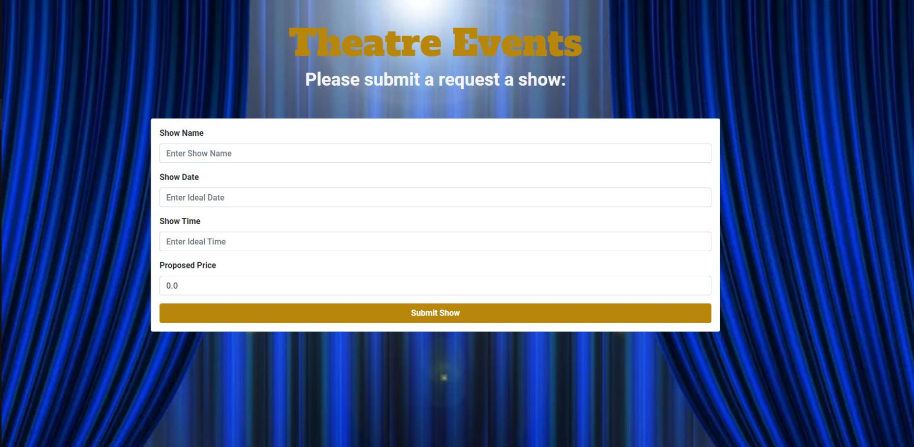
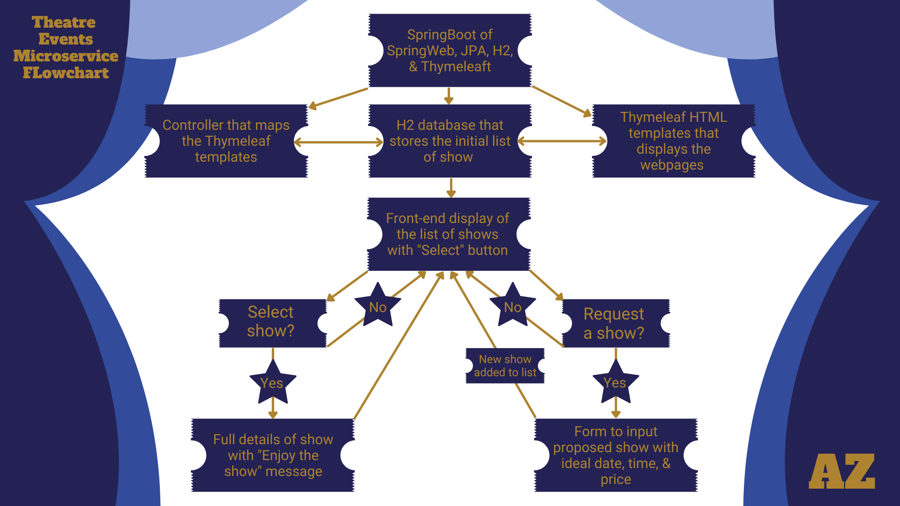
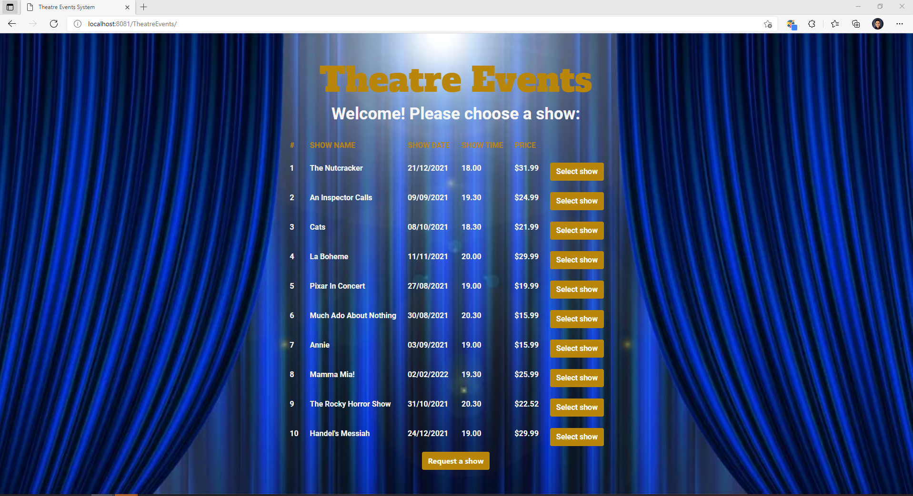
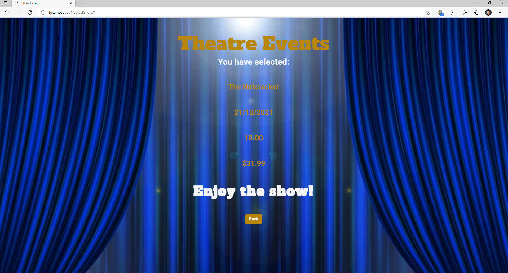
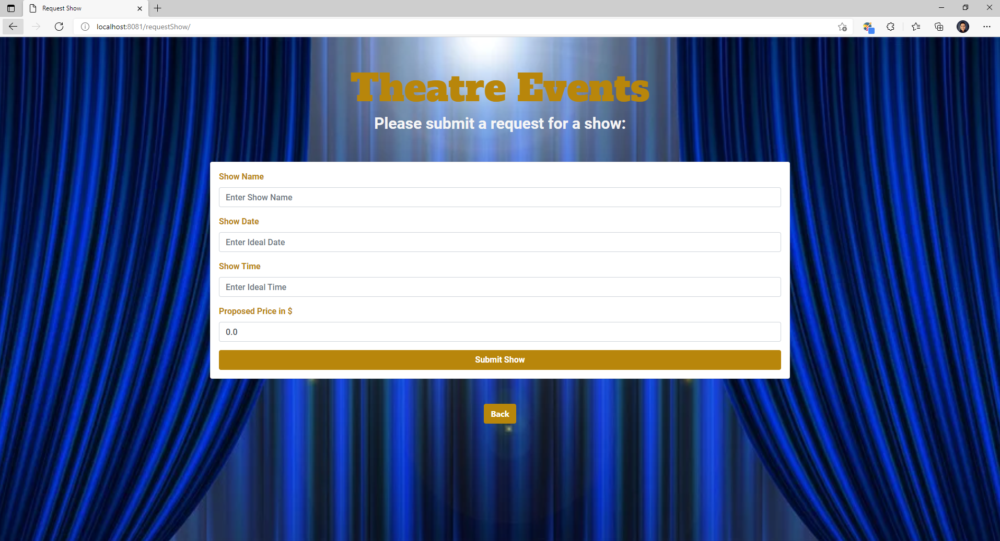

# Theatre Events MS - Part B
***

This project is a Microservice (MS) that follows on from Part A of the Capstone Project that was a Command Line Application (APP). Microservices are "an architectural and organizational approach to software development where a software is composed of a small independent services that communicate over well-defined APIs" (as it is explained in the [AWS](https://aws.amazon.com/microservices/) article on Microservices).

**Theme: _Theatre Events_**

For this MS, I continue on with my theme of Theatre Events that I used in Part A of the Command Line APP, as I am excited to see how my list of theatre shows would display as an actual website with design added to it. Having had completed a Design bootcamp before joining Step It Up Australia, I was keen to add my design skills to this project along with my Java skills.

**The Inspiration:**

The inspiration for this topic came to me when in the shower after I had seen The Game Plan that starred Dwayne "The Rock" Johnson and Roselyn Sanche. In one scene, they both danced a beautiful ballet that made me realise how much I miss the theatre. I love the theatre because it provides me some escapism from reality, while I get to enjoy talented people's creativity, while keeping in touch with my arts background. I believed it would be an excellent theme for the Capstone Project.

## Requirements

---
For Part B of the Capstone Project, I learnt that these are the requirements are essential for the MS to ensure a working architecture with an organised approach:

* **IntelliJ IDEA Integrated Development Environment (IDE)**
  * After working with Eclipse for most of the internship, I had decided to switch over to IntelliJ IDEA because I knew that IntelliJ is the preferred IDE of Macquarie. Furthermore, I wanted to ensure that my MS has no problems running between mine and everyone else's in the Macquarie or Goanna Education.
* **Java Development Kit (JDK) 1.8**
    * Throughout the course, we had been focusing on JDK 1.8. Therefore, I chose this for the project to ensure that the MS will run as smoothly as possible.
* **Maven Dependencies**
  * Spring Web (Web): _this dependency was chosen for the ability to build web applications using Spring MVC_
  * H2 Database (SQL): _this is a fast in-memory database that allows me to store my information to be connected to the MS_
  * Spring Data JPA (SQL): _this persists data in SQL stores with Java Persistence API using Spring Data and Hibernate_
  * Thymeleaf (Template Engines):_a natural Java template for web environment to allow Bootstrap, HTML5, and CSS to be correctly displayed in browsers_
* **JUnit Maven Dependency**: _Testing framework used for Java projects for Unit Testing purposes with a Maven dependency_

## Planning

---
**Sunday**:

* Ensure all MS requirements are available and in order before beginning development
* Generate SpringBoot project via IntelliJ IDEA IDE:
  * Create New Project
  * Spring Initializer 
  * Add dependencies of _Spring Web_, _H2 Database_, and _JPA_
* Share on GitHub with a new repository direct from IntelliJ, so that it is easy to make commits

**Monday** 

* Double-check the dependencies, and add any if needed, such as _Thymeleaf_
* Start adding to Documentation of README.md

* Create the four packages in the SpringBoot project in IntelliJ: 
  1. Controller
  2. Model
  3. Repository
  4. Service
  

* Start with the `@Entity` Model class (Show) with `@ID` with variables of: 
  1. private Long id; 
  2. private String showName; 
  3. private String showDate; 
  4. private String showTime; 
  5. private double price; 
  6. Along with the Constructors, Getters and Setters

   * Link with Repository interface (ShowRepository), so it stores objects to the database that extends _JPARepository_ of Show and Long (id)
   * Create the Controller class (ShowController) with `@Controller` `@GetMapping` of _TheatreEvents_ and _SelectShow_ to map the Thymeleaf templates
   * Set up the H2 Database in the application.properties and Make a simple endpoint to start with http://localhost:8081/ and a database with http://localhost:8081/h2-console/
   * Create a Thymeleaf template with `index.html`, which allows endpoint to display with table of Show Name, Show Date, Show Time, and Price, which will be mapped by Controller
   * Think about what should be stored in the H2 Database: a list of shows with time, date, and price?

**Tuesday**

* Sketch a wireframe (a sketch of a screen blueprint) to plan a basic map of the front-end's main landing page
* Think of how the page should look: should the data be a drop-down on the front end? Could users click on a show to see more details?
* Design a webpage in [Canva](https://www.canva.com/), as Adobe cannot be used due to time constraints, to give a visualisation of an aim how the front end should look, complete with background image, typefaces, and colours
* Begin preparing the presentation
*  Start adding to Documentation of README.md to add to the Implementation plan as I go along

**Wednesday** 

* Add Bootstrap, HTML, and CSS to `index.html` to get the design implemented into the project, including background image, typefaces, and colours
* Give the endpoint a name that relates to the theme: http://localhost:8081/TheatreEvents
* Try out different ideas of what to be displayed on the front-end point: Show Name and Select? Or all show detail and Select for further information?
* Add second `@GetMapping` in _ShowController_ for show details and create a new HTML file of `showDetails.html` so that users can see all the show details along with a parting message of "Enjoy the show"

**Thursday**

* Create a ShowService class and ShowServiceImp interface in the Service package to allow user input to go into the database and added to the ShowController with `@PostMapping` and four methods of in the Interface of:
  * `getAllShows()`
  * `getShowsById(Long id)`
  * `saveOrUpdate(Show show)`
  * `delete(Long id)`

* Add a _requestShow_ page with `requestShow.html`for the users to request a show they wish to see, and add a `@PostMapping` in ShowController to enable it, and add a button in `index.html` to take users to the new page to request a show. Any shows added will be stored in the H2 Database and added to the list of shows already displaying in http://localhost:8081/TheatreEvents
* Add an interactive form in `requestShow.html` to make it easy for users to request a show, while initializing Bootstrap, HTML, and CSS to get the design implemented into the project, including background image, typefaces, and colours

**Friday**

* Ensure that the design is all consistent throughout the MS, and that it runs well with the shows displaying correctly
* Develop three JUnit tests to make sure that the MS is working correctly in Controller and ShowServiceImpl

## Statement of Purpose

---
**What this Microservice will do:**

The aim of this MS app is to create a SpringBoot application that stores a list of shows with their ID, name, date, time, and price in an H2 Database that will be sent to a front-end Spring Web landing page via a Controller than maps the Thymeleaf template of HTML & CSS with Bootstrap.

Next, the database list will be sent to display in a user-friendly, and visually-pleasing, Spring Web front-end Theatre Events webpage that enables user interaction with good User Experience (US). With the front-end webpage, the user can select one of the theatre shows from the list with ease. 

Differing from Part A of this project, instead of being given a list of the available shows when the one the user wishes to see is not available, the user will be able to request a show instead with the proposed show name, with their ideal date, time, and price. This information will be sent back to the H2 Database for storage and will be displayed on the main page, joining the list of already-lined up shows.

**What business problem it addresses:**

The MS addresses the business problem of users of scrolling down a long-list of a drop-down menu, which can be tiresome and frustrating. With this MS webpage, the user can just select from a ready-prepared list of shows that are simply displayed on the homepage, and can easily access the "Select Show" button on the far right, which is available after Number of Show, Show Name, Show Date, Show Time, and Price. 

As an extra bonus with this website, users can request a show that they may be interested in, thus inputting a proposed show with an ideal time, date, and a price they would be willing to pay. This is different for usual theatre websites, which often just requires the user to choose only shows that are available already. Therefore, it provides a new Unique Selling Point (USP) and fills a gap in the market. A feature like this will make the user feel excited and more empowered about their position of consumerism. Users can request a show on the Request Show page that they can access by clicking on the "Request Show" button on the bottom of the landing page, underneath the list of shows.

**The target audience**

The target audience of this MS are culture-lovers and fans of theatre, who make visits to the theatre part of their free time. Furthermore, they are also keen Internet users, and they would appreciate a user-friendly website where they were presented a list of shows straightaway without having to scroll through a never-end list. They will love the feature where they can request a show, as not many theatre-loving, Internet users get that opportunity.

## Features

---
These are the features of the Theatre Events MS:

1. A main, landing page of a list of initial shows with ID and details of Name, Date, Time, and Price in `TheatreEvents`
   * _The list of shows is stored in the backend with the H2 Database_
2. Users can select a show that hovers over the details for highlighting and easy selection 
   * _The list of shows are stored in an HTML hover table, so it is easier for users to see which show they are choosing_
3. When users select a show via the "Select Show" button, they will be taken to a `ShowDetails` page with the all the show's details of Name, Date, Time, and Price and a departing message of "Enjoy the Show"
   * _I added this pleasant feature to make the user feel appreciated for selecting a show_
   * _Plus, it is always lovely to receive an "Enjoy the show" message when one goes to see a show, and it is a good, final message_
4. To return to `TheatreEvents` main page, users can click the "Back" button underneath the departing message 
   * _The back button makes it for easy UX experience to return to the main page_
5. If users do not see the show they want, they have an opportunity to request a show, via the "Request Show" button , which is available underneath the list of shows 
   * _This is the best feature of all because of the unique opportunity to request a show, which  fills a gap in the market_
   * _Not many theatre booking websites offer this feature, thus this presents a feature that theatre websites could implement in the future_
6. To request a show, the user is taken to the `RequestShow` page, and they can input a proposed show name with ideal date, time, and price in the form and click the "Submit" button 
   * _I created a Bootstrap form for easy input that is clear and easy to use, hile still staying with the gold theatre theme_
7. Once the requested show has been submitted, the user is taken back to the `TheatreEvents` page, where the output of the new show is displayed at the bottom of the show list with a new ID that has been generated
   * _I would have liked to have also created another page that says "Thank you for your request - it has been submitted for consideration" before heading back to `TheatreEvents` but due to time constraints of this project, it was not possible_
8. If users change their mind on `Request Show`and decide that they do not want to make a request, they can return to the `Theatre Events` main page by clicking the "Back" button that is located underneath the form
   * _I felt that this was a good option to give the user, as one may change their mind at the last minute. Instead of them being stuck with no way of navigation, I added this for good UX with ease of use of the app_

## Implementation Plan - Part A: Design

---
The Implementation Plan split into two part: Design and Programming. They worked side by side as the app was being implemented step by step. By thinking of the design, it made it easier to know what to code to what I wanted to the endpoint to look like.

While I was setting up the files, I made a wireframe (a sketch of a screen blueprint), which the creative process of this MS application:

The idea came to me while I was drifting in and out of sleep. I had a vision of the theatre curtains in the background, and a welcome message displayed on the top with the app name. Underneath, I wanted there to be a User Interface (UI) a hamburger menu with four separate drop-down choice of:

1. Show name
2. Show date
3. Show time
4. Finalised details with the price
 
Continuing on from Part A, I also wanted an option underneath for the user if they do not find the show they want, so they can look at a list of shows available.

To assist myself with a visual aim of how the front-end will look for the user, I created a design in [Canva](https://www.canva.com/), which helped to solidify my ideas more:

However, the creative process changed with how I visualised the microservice to be like to how I was able to implement it with my Java skills. 

However, not being able to implement the hamburger menu, and having to use a table instead, the biggest challenge in this creative process was getting the background. As there were many aspects in the `index.html` that one could use to get the background up. Eventually after much searching on Bing.com, I found a tutorial on backgrounds with [Bootstrap](https://startbootstrap.com/snippets/full-image-background). As a result, I managed to get background like this with the table nestled in between the curtains, as displayed on my monitor. This was my initial display:

Furthermore, I didn't want my table to look too much like a table, so I tried to make it as transparent as possible. I included the feature of the table hovering, so it would be easier for users to see which show they were picking. I also wanted the typefaces to be in a consistent colour theme that reflected the curtains and the magic of the theatre:

I also created `ShowDetails` page, which the user goes to once they click on the "Select Show" that displays all the details of the show (minus the ID) and a departing message of "Enjoy the show". Later, I added the Dollar ($) so that it looks more consistent in the design. Furthermore, the users can return to the `TheatreEvents` page with the "Back" button underneath the departing message:

Originally, the design was just going to be the `TheatreEvents` page and the `ShowDetails` page only linking together with the list input in the H2 Database by myself. 

But at the last minute, I began to feel an extra page giving a special features would be beneficial to this project where the user can give an input a show themselves, instead of just clicking on "Select Show" and "Back" buttons. So, I created, and designed, a `Request Show` page where the user can request a show, which is a unique feature. Here, I created Bootstrap table where the user could propose the new show, along with ideal date, time, and price with a "Submit" button, which was later designed better to be cohesive with the theme: 

I also included a "Back" button in case the user changed their mind about requesting, and wanted to return to `TheatreEvents` to select an already-available show instead. And I designed the app so that the same "Back" button be available on every page, so that the user had choice, and were able to navigate the app. I also had another huge challenge with the buttons because the button in Thymeleaf would not style as I wished it to, so after much searching, I had to use Bootstrap only, which made my design tasks much easier.

## Flowchart of the Design of the MS

---

This is a flowchart that demonstrates the design of the MS. To keep with the theme of the theatre, instead of little boxes that depict the flow, I used theatre tickets

## Implementation Plan - Part B: Programming

---
|Step| Process / Task | Particulars / Files / Fields | Comments |
|----|-----------------|---------|----------|
|1   | Create files and repository direct from IntelliJ IDEA after setting up "New Project" with Spring Initializer using Maven, and create a README.md from scratch | .gitnore, .mvn/wrapper, README.md, mvnw, pom.xml, application.properties, TheatreEventsApplicationTests | Chose the dependencies of Spring Web, H2, and JPA, so that the microservice will be a Spring app connecting to the Database |
|2 | Double-check dependencies and add any new ones, if needed | pom.xml | Added the Thymeleaf dependency |
|3 | Create the Model and add @Entity to store objects to the database with Model and Repository packages, new information in README.md | Show.java (@Id, @GeneratedValue, Getters/Setters), showRepository (@Repository), application.properties (setting up h2 database) index.html (Thymeleaf), TheatreEventsApplication.java (@public static main) | Store list of shows with dates, times, price and store the user inputs | 
| 4 | Create a Controller in the Controller package | Controller: ShowController.java (@Controller, @GetMapping) | Make a simple endpoint to start with http://localhost:8081/ and a database with http://localhost:8081/h2-console/|
|5 | Create a Thymeleaf template in index.html | /h2-console, table of ShowList with @{/addShow}, BootStrap | Allow endpoint to display |
| 6| Think about what should be stored in the database | | List of shows with time, date, and price? Should it be drop-down? Could users click on a link of a show to see details?
| 7 | Make a sketch of an initial visual idea, and design a front-end visualization in [Canva](https://www.canva.com/) | | Theatre curtains? Site name and welcome? Menu? User input? Drop down menu?|
| 8 | Add PNG of visualisation to the file, and embed under the Visualisation heading, continuing updating README.md with text on Statement of Purpose, Features, and Visualisation | README.md | Use the correct headings, bold text, embedding, tables, and links |
|9|Give endpoint a name for direction | |http://localhost:8081/TheatreEvents |
| 10| Make the end point only display show name first and a select button and a separate page to display all show details when user selects a show name | Added a second @GetMapping in ShowController for show details and showDetails.html for the show details | Primitive at this stage, but will think on how to do the design - only three shows displaying too |
|11| Revert to previous idea of show details displaying on second page after user clicking "select show" and decided to keep all show details on landing page instead | index.html,  |  |
|12| Begin designing the landing page of show details | index.html, Bootstrap, CSS | Imported an image of the same blue theatre curtains in the Visualisation into newly made img directory, and tried to link it to index.html |
|13| Add photo of the initial front-end sketch to demonstrate mental journey of visual plan| | Import to img folder as png, along with the Canva design |
|14| Add the background image and CSS to index.html file | index.html, CSS, Bootstrap, HTML | URL image was linked directly to theatre curtains on Pixabay, instead of the .png in the img folder |
|15| Create a ShowService class, and ShowServiceImpl and include methods and functions so that it connects the user interaction back to the database | Service: ShowService and ShowServiceImpl | 
| 16 | Create a requestShow.html, so that users can request a show via a user input form. Add @GetMapping and @PostMapping to the ShowController for requestShow, so that every time the input goes through, it connects back to the database and logs the requested show details | ShowController: @GetMapping, @PostMapping; requestShow.html| |
| 17 | Ensure all pages are consistent in design |||

## Final Front-end of the Theatre Events MS App:

---
The `TheatreEvents` landing page:

The `ShowDetails`page when user selects a show:

The `RequestShow` page for when a user can request a show via form input:

